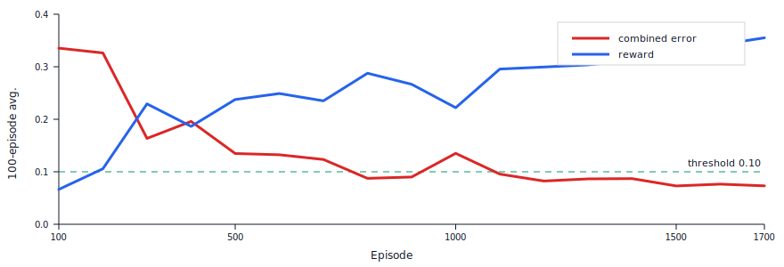
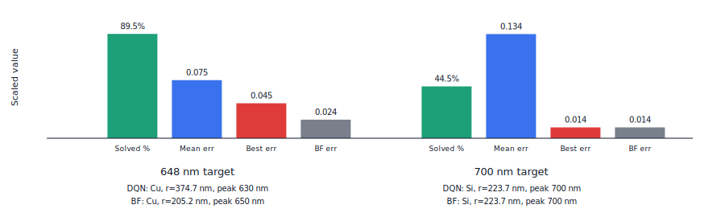
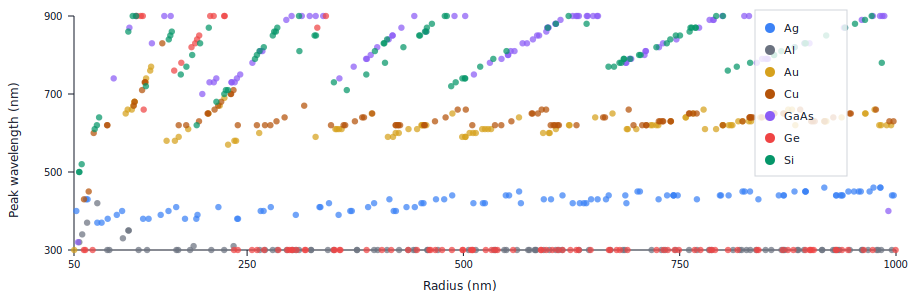

# Reinforcement Learning for Inverse Design of Mie-Scattering Nanoparticles

Authors: Furkan Akkoyun, Mehmet Emre Andıran, Jane Klavir, Bekir Bartu Cebeci

RL methods for nanophotonic design. The forward problem which predicts the
optical response of a particle from its geometry and material is solved by
**Mie theory**. This repo uses RL to do **inverse design**: find the
particle whose spectrum matches a desired target.

The pipeline starts by using [`miepython`](https://github.com/scottprahl/miepython)
to generate ground-truth scattering / absorption / extinction spectra for
spherical nanoparticles across a range of radii and materials.

## Reinforcement Learning & Inverse Design

Instead of training a separate supervised neural network to directly predict a design from a target response, we formulate the inverse design as a target-conditioned sequential search problem navigating the precomputed Mie dataset. 

The agent treats the design space as a finite Markov Decision Process (MDP):
* **State Space (9-D):** The state vector contains the normalized current material index, radius index, scattering peak, absorption peak, the corresponding target peak observables, and the current scale-normalized error.
* **Action Space (5 Discrete Actions):** Decrease radius, increase radius, switch to previous material, switch to next material, or STOP and commit.
* **Reward Structure:** The agent receives a shaped reward based on the reduction of the combined error between steps. Moves that reduce error yield positive rewards; moves away yield penalties. The STOP action grants a +3 terminal bonus if the candidate satisfies the success threshold ($|\Delta\lambda| <$ 10 nm and $E \le$ 0.10).

### Dueling Double-DQN Architecture

We trained a **Dueling Double-DQN** to handle the search. The dueling architecture is particularly effective here because it separates the value of being at a specific material-radius state from the relative advantage of making a specific edit (e.g., changing the radius vs. switching the material).

* **Network Trunk:** A shared Multilayer Perceptron (MLP) mapping $9\rightarrow256\rightarrow256$ with LayerNorm and ReLU activations.
* **Streams:** The trunk splits into a 1D Value stream and a 5D Advantage stream, which are then recombined.
* **Stabilizers:** The pipeline utilizes an experience replay buffer (capacity 50,000) to break trajectory correlation, alongside a slowly updated target network to minimize Bellman overestimation bias. 
* **Optimization:** Minimized using Huber loss (smooth L1) via the Adam optimizer.


*Training dynamics over 1700 episodes. The combined weighted error steadily decreases, crossing the 0.10 success threshold as the agent learns to navigate the dataset.*

### Results

Evaluated on held-out targets, the RL agent achieved a mean wavelength error of 1.0 nm and an average success rate of 72.1%. On all tested targets, the agent successfully recovered the exact material choice found by exhaustive brute-force search.


*Performance query summary. For a 700 nm target, the policy recovered the exact brute-force optimum: a Silicon sphere with a 223.7 nm radius.*

---

## Setup

Create and activate a Python environment (conda or venv), then from the repo
root:

```bash
pip install -r requirements.txt
pip install -e .
```

## Quickstart

Generate the main materials × radii dataset (700 samples default):

```bash
python scripts/generate_materials_dataset.py
```

## Physics

A nanoparticle (radius `r`, complex refractive index `m(λ) = n(λ) − i·k(λ)`,
sitting in a medium of index `n_med`) hit by light of wavelength `λ` can
**absorb**, **scatter**, and **extinguish** photons. The corresponding
cross-sections — `σ_abs`, `σ_sca`, `σ_ext = σ_abs + σ_sca` — have units of area
(nm²) and are functions of `λ`. For a homogeneous sphere there is an exact
analytic solution to Maxwell's equations (Mie, 1908) parameterised by the
**size parameter** `x = 2π·r·n_med / λ`. `miepython.efficiencies_mx(m, x)`
evaluates the series for us; everything else in this repo is data plumbing
around that one call.


*The peak landscape of our generated dataset, illustrating the non-linear relationship between radius, material, and scattering resonances.*

## Materials folder format

Each CSV in [Materials/](Materials/) is a refractiveindex.info-style file with
two stacked tables — `wl,n` then a blank line then `wl,k` — and wavelengths in
**micrometers**:

```
wl,n
0.1879,1.28
0.1916,1.32
...
1.9370,0.92

wl,k
0.1879,1.188
0.1916,1.203
...
1.9370,13.78
```

## Main dataset format

Produced by [`scripts/generate_materials_dataset.py`](scripts/generate_materials_dataset.py).
A single compressed `.npz` with a **two-tier** layout — small material-level
arrays (one row per material) plus large run-level arrays (one row per Mie
simulation).

| Key | Shape | Description |
| --- | --- | --- |
| `wavelengths_nm` | `(W,)` | Shared wavelength grid (nm). Default: 300 → 900 nm in 10 nm steps, so `W = 61`. |
| `material_names` | `(M,)` | String labels, e.g. `['Ag','Al','Au','Cu','GaAs','Ge','Si']`. |
| `materials_n` | `(M, W)` | `n(λ)` for each material on the shared grid. |
| `materials_k` | `(M, W)` | `k(λ)` for each material on the shared grid. |
| `radius_nm` | `(N,)` | Per-run particle radius (nm). |
| `n_medium` | `(N,)` | Per-run surrounding-medium refractive index. |
| `material_id` | `(N,)` | Per-run material name; references back into `material_names`. |
| `geometry` | `(N,)` | Per-run geometry tag, currently `'sphere'`. Forward-compatible with `'rod'`, `'shell'`, … |
| `sigma_sca` | `(N, W)` | Scattering cross-section vs λ (nm²). |
| `sigma_abs` | `(N, W)` | Absorption cross-section vs λ (nm²). |
| `sigma_ext` | `(N, W)` | Extinction cross-section vs λ (nm²). Always equals `sigma_sca + sigma_abs` exactly. |

Defaults: 100 samples per material × 7 materials = **700 runs**, radii sampled
uniformly in [50, 1000] nm with a fixed seed, medium = air (`n=1.0`).

### What one run looks like

Each row in the run-level arrays is one Mie simulation. For run `i` you get:

| Field | Shape | Meaning |
| --- | --- | --- |
| `material_id[i]` | scalar (string) | e.g. `"Au"` — references back into `material_names` |
| `geometry[i]` | scalar (string) | e.g. `"sphere"` |
| `radius_nm[i]` | scalar (float) | particle radius, e.g. `354.0` nm |
| `n_medium[i]` | scalar (float) | surrounding-medium refractive index (1.0 = air by default) |
| `sigma_sca[i, :]` | `(W,)` | scattering cross-section as a function of λ |
| `sigma_abs[i, :]` | `(W,)` | absorption cross-section as a function of λ |
| `sigma_ext[i, :]` | `(W,)` | extinction (= `sigma_sca[i] + sigma_abs[i]`) |

The wavelength axis those spectra live on is the shared `wavelengths_nm` of
shape `(W,)` — the same for every run. To recover that run's `n(λ), k(λ)`,
look up `material_id[i]` in `material_names` and index `materials_n`,
`materials_k`:

```python
i = 0
m_idx = list(material_names).index(str(material_id[i]))
n_i, k_i = materials_n[m_idx], materials_k[m_idx]   # both (W,)
```

So each row = one simulated nanoparticle = (material name, radius, three
spectra over λ).

CLI flags (all optional):

```bash
python scripts/generate_materials_dataset.py \
    --n-samples-per-material 100 \
    --radius-min-nm 50 --radius-max-nm 1000 \
    --wavelength-min-nm 300 --wavelength-max-nm 900 --wavelength-step-nm 10 \
    --n-medium 1.0 --seed 0 \
    --output data/processed/mie_materials_v1.npz
```

## How the pipeline works

For each run, the script calls `compute_mie_spectrum` ([src/nano_mie/simulator.py](src/nano_mie/simulator.py)),
which is a thin wrapper around `miepython.efficiencies_mx`:

```python
m  = (n(λ) − i·k(λ)) / n_medium                # complex refractive index (relative)
x  = 2π · radius_nm · n_medium / wavelengths_nm # Mie size parameter, one per λ
qext, qsca, qback, g = mie.efficiencies_mx(m, x)
sigma_ext = qext · π · r²
sigma_sca = qsca · π · r²
sigma_abs = (qext − qsca) · π · r²
```

`n` and `k` can be scalars (constant in λ) or arrays of shape `(W,)`. Real
materials use the per-wavelength array form.

## Loading a saved dataset

```python
import numpy as np
data = np.load("data/processed/mie_materials_v1.npz", allow_pickle=False)

wl         = data["wavelengths_nm"]      # (61,)
mat_names  = list(data["material_names"]) # ['Ag','Al','Au','Cu','GaAs','Ge','Si']
mat_n      = data["materials_n"]         # (7, 61)
mat_k      = data["materials_k"]         # (7, 61)

r          = data["radius_nm"]           # (700,)
n_medium   = data["n_medium"]            # (700,)
mat_id     = data["material_id"]         # (700,) of strings
geometry   = data["geometry"]            # (700,) of strings, e.g. 'sphere'
sigma_sca  = data["sigma_sca"]           # (700, 61)
sigma_abs  = data["sigma_abs"]           # (700, 61)
sigma_ext  = data["sigma_ext"]           # (700, 61)

# Everything you need to fully describe run i:
i = 0

# scalars
radius_i    = float(r[i])                                # particle radius (nm)
n_medium_i  = float(n_medium[i])                         # surrounding-medium index
material_i  = str(mat_id[i])                             # e.g. 'Au'
geometry_i  = str(geometry[i])                           # e.g. 'sphere'

# material n(λ), k(λ) — pulled from the material-level tables by name
m_idx = mat_names.index(material_i)
n_i   = mat_n[m_idx]                                     # (61,)
k_i   = mat_k[m_idx]                                     # (61,)

# spectra (all on the shared wavelength axis `wl`)
sca_i = sigma_sca[i]                                     # (61,)
abs_i = sigma_abs[i]                                     # (61,)
ext_i = sigma_ext[i]                                     # (61,) == sca_i + abs_i

print(f"run {i}: {geometry_i}, material={material_i}, r={radius_i:.1f} nm, "
      f"n_med={n_medium_i:.2f}")
print(f"  λ grid:   {wl[0]:.0f} → {wl[-1]:.0f} nm "
      f"({wl.size} points, step {wl[1]-wl[0]:.0f} nm)")
print(f"  σ_sca peak at λ={wl[sca_i.argmax()]:.0f} nm, value={sca_i.max():.1f} nm²")
```

```python
import matplotlib.pyplot as plt
plt.plot(wl, sca_i, label="σ_sca")
plt.plot(wl, abs_i, label="σ_abs")
plt.plot(wl, ext_i, label="σ_ext", linestyle="--")
plt.xlabel("Wavelength (nm)"); plt.ylabel("Cross section (nm²)")
plt.legend(); plt.title(f"{material_i}, r={radius_i:.0f} nm")
plt.show()
```
